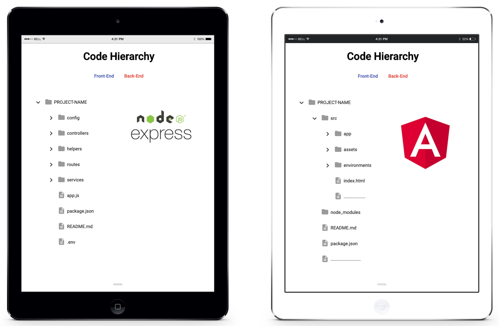

# Code Hierarchy

This project was generated with [Angular CLI](https://github.com/angular/angular-cli) version 8.2.1.

## Setup

`npm install`

## Development server

Run `ng serve` for a dev server. Navigate to `http://localhost:4200/`. The app will automatically reload if you change any of the source files.

## Build

Run `ng build` to build the project. The build artifacts will be stored in the `dist/` directory. Use the `--prod` flag for a production build.

## How is Directory

### Front-end Architecture

```
PROJECT_NAME
├── src
│    ├── app
│    │   ├── app(style)
│    │   ├── app(template)
│    │   ├── app(script)
│    │   ├── app(module)
│    │   ├── app(routing)
│    │   ├── components
│    │   │   ├── componentA
│    │   │   ├── componentB
│    │   │   └── componentC
│    │   ├── layouts
│    │   │   ├── footer
│    │   │   ├── navbar
│    │   │   └── sidebar
│    │   ├── views
│    │   │   ├── home
│    │   │   ├── login
│    │   │   └── error
│    │   ├── core
│    │   │   ├── http
│    │   │   │   ├── class
│    │   │   │   │   ├── query-string-parameters.ts
│    │   │   │   │   └── url-builder.ts
│    │   │   │   ├── endpoints
│    │   │   │   │   ├── actions.ts
│    │   │   │   │   ├── endpoint-service 0-N
│    │   │   │   └── services
│    │   │   │   │   ├── api-endpoints.service
│    │   │   │   │   └── api-http.service
│    │   │   ├── mocks
│    │   │   └── authentication
│    │   ├── modules
│    │   ├── shared
│    │   │   ├── components
│    │   │   ├── services
│    │   │   ├── directives
│    │   │   ├── pipes
│    │   │   ├── models
│    │   │   ├── states
│    │   │   └── constant
│    ├── assets
│    │   ├── images
│    │   └── scss
│    ├── environments
│    │   ├── environment.prod.ts
│    │   └── environment.ts
│    └── index.html
├── node_modules
├── README.md
└── package.json
```

### Backend Architecture

```
PROJECT_NAME
├── config
│   └── permission.js
├── controllers
│   ├── Controller1
│   ├── Controller2
│   └── Controller3
├── models
│   ├── Model1
│   ├── Model2
│   └── Model3
├── helpers
│   └── constants.js
├── routes
│   ├── api.js(Bundle routes)
│   ├── route1
│   └── route2
├── services
│   ├── auth.js
│   ├── Database access
│   └── External API
├── app.js
├── package.json
├── README.md
└── .env
```

## Resources

[Material Tree](https://stackblitz.com/edit/material-tree)

[Reuse Routing Strategy](https://stackblitz.com/edit/angular-route-reuse-strategy-test-project)



[Live Demo](https://codehierarchy.netlify.app)
